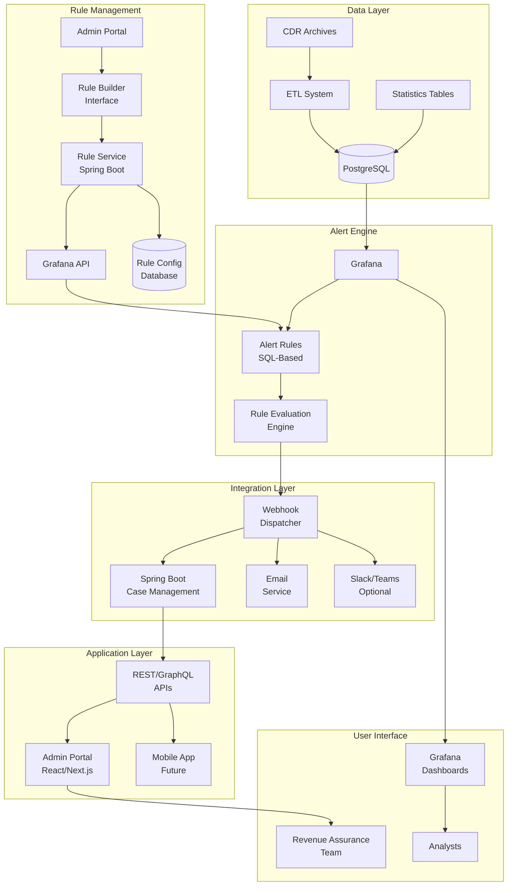

# System Architecture Design
# Case Tools v2.0 - Grafana-Native Alert Management

## 📊 Implementation Status

### ✅ Completed Components
- ✅ Spring Boot backend structure with JWT authentication
- ✅ Core services (User, Case, Webhook, Notification)
- ✅ Alert Rule Builder service with CRUD operations
- ✅ Grafana API integration service
- ✅ WebSocket configuration for real-time updates
- ✅ Next.js frontend with Ant Design Pro
- ✅ Authentication system with Zustand store
- ✅ Dashboard with real-time metrics
- ✅ Alert Rules management interface
- ✅ Visual Rule Builder with SQL editor

### 🔄 In Progress
- 🔄 Documentation updates

### 📋 TODO Components
- ⏳ Grafana dashboards and initial alert rules setup
- ⏳ WildFly deployment configuration
- ⏳ Integration tests
- ⏳ Production deployment scripts
- ⏳ Monitoring and observability setup
- ⏳ Backup and disaster recovery procedures

## Architecture Overview

The Case Tools v2.0 architecture represents a paradigm shift from legacy C/ECPG programs to a modern, Grafana-native alerting system integrated with Spring Boot microservices and a React-based admin portal.

## System Architecture Diagram



## Component Architecture

### 1. Data Layer

#### PostgreSQL Database
- **Purpose**: Central data repository
- **Schemas**:
  - `cdrs_archives`: Raw CDR data partitioned by day
  - `stat`: Aggregated statistics and metrics
  - `tableref`: Reference data and configurations
  - `casemanagement`: User and case management
  - `grafana`: Grafana integration logs
  - `config`: System configurations

#### ETL System (Existing)
- Processes raw CDRs into structured format
- Generates statistical aggregations
- Maintains data quality and integrity

### 2. Alert Engine (Grafana)

#### Core Components
```yaml
Grafana Instance:
  Version: 10.x
  Mode: Standalone (HA optional)
  Components:
    - Alert Manager
    - Dashboard Engine
    - Datasource Manager
    - Notification Channels
    - API for Dynamic Rules
```

#### Alert Rule Architecture

##### System-Generated Rules (from C program migration)
```sql
-- Example Alert Rule Structure
WITH base_metrics AS (
    SELECT 
        date_trunc('minute', NOW()) as evaluation_time,
        msc_name,
        COUNT(*) as total_calls,
        SUM(CASE WHEN status = 'DROPPED' THEN 1 ELSE 0 END) as dropped_calls
    FROM stat.stattraficmsc
    WHERE date_stat = CURRENT_DATE
      AND time > NOW() - INTERVAL '5 minutes'
    GROUP BY msc_name
),
alert_evaluation AS (
    SELECT 
        evaluation_time,
        msc_name,
        dropped_calls * 100.0 / NULLIF(total_calls, 0) as drop_rate,
        CASE 
            WHEN dropped_calls * 100.0 / NULLIF(total_calls, 0) > 10 THEN 'CRITICAL'
            WHEN dropped_calls * 100.0 / NULLIF(total_calls, 0) > 5 THEN 'WARNING'
            ELSE 'OK'
        END as severity
    FROM base_metrics
)
SELECT * FROM alert_evaluation WHERE severity != 'OK';
```

##### User-Defined Rules (Dynamic Rule Builder)
```yaml
Rule Creation Flow:
  1. User Interface:
     - Visual Query Builder
     - Threshold Configuration
     - Schedule Settings
     - Notification Preferences
  
  2. Rule Service:
     - Query Validation
     - SQL Generation
     - Test Execution
     - Grafana Deployment
  
  3. Grafana Integration:
     - API-based Rule Creation
     - Dynamic Rule Updates
     - Rule Versioning
     - Automatic Rollback

Rule Types:
  - Threshold-based: Static value comparison
  - Trend-based: Rate of change detection
  - Anomaly-based: Statistical deviation
  - Pattern-based: Complex event correlation
```

### 3. Spring Boot Microservices

#### Service Architecture ✅ IMPLEMENTED
```
spring-boot-services/
├── case-management-service/
│   ├── src/main/java/com/elite/casetools/
│   │   ├── controller/
│   │   │   ├── CaseController.java ✅
│   │   │   ├── WebhookController.java ✅
│   │   │   ├── UserController.java ✅
│   │   │   └── AlertRuleController.java ✅
│   │   ├── service/
│   │   │   ├── CaseService.java ✅
│   │   │   ├── AlertProcessingService.java ✅
│   │   │   ├── NotificationService.java ✅
│   │   │   ├── AlertRuleService.java ✅
│   │   │   ├── QueryValidationService.java ⏳
│   │   │   └── GrafanaService.java ✅
│   │   ├── repository/
│   │   │   ├── CaseRepository.java
│   │   │   ├── UserRepository.java
│   │   │   └── AlertRuleRepository.java
│   │   ├── entity/
│   │   │   ├── Case.java ✅
│   │   │   ├── User.java ✅
│   │   │   ├── Alert.java ⏳
│   │   │   └── AlertRule.java ✅
│   │   ├── integration/
│   │   │   ├── GrafanaApiClient.java
│   │   │   └── EmailClient.java
│   │   └── config/
│   │       ├── SecurityConfig.java ✅
│   │       ├── WebSocketConfig.java ✅
│   │       ├── GrafanaConfig.java ✅
│   │       ├── RestTemplateConfig.java ✅
│   │       └── JacksonConfig.java ✅
│   └── resources/
│       └── application.yml
```

#### Key Services

**Alert Processing Service**
```java
@Service
public class AlertProcessingService {
    
    @Transactional
    public Case processGrafanaAlert(GrafanaWebhook webhook) {
        // 1. Parse and validate alert
        Alert alert = parseAlert(webhook);
        
        // 2. Check for duplicates
        if (isDuplicate(alert)) {
            return mergWithExisting(alert);
        }
        
        // 3. Create case
        Case newCase = Case.builder()
            .alertId(alert.getId())
            .severity(alert.getSeverity())
            .title(alert.getTitle())
            .status(CaseStatus.OPEN)
            .build();
            
        // 4. Apply business rules
        applyAssignmentRules(newCase);
        
        // 5. Send notifications
        notificationService.notify(newCase);
        
        return caseRepository.save(newCase);
    }
}
```

**Alert Rule Builder Service**
```java
@Service
public class AlertRuleBuilderService {
    
    @Autowired
    private GrafanaApiClient grafanaClient;
    
    public AlertRule createUserDefinedRule(RuleRequest request) {
        // 1. Build SQL from visual configuration
        String sql = buildSQLFromConfig(request.getQueryConfig());
        
        // 2. Validate query
        ValidationResult validation = validateQuery(sql);
        
        // 3. Store rule configuration
        AlertRuleDefinition rule = saveRuleDefinition(request);
        
        // 4. Deploy to Grafana
        String grafanaUid = grafanaClient.createAlertRule(
            convertToGrafanaFormat(rule, sql)
        );
        
        // 5. Update rule with Grafana reference
        rule.setGrafanaUid(grafanaUid);
        rule.setStatus("DEPLOYED");
        
        return rule;
    }
    
    private String buildSQLFromConfig(QueryConfig config) {
        return new SQLBuilder()
            .select(config.getAggregation())
            .from(config.getTable())
            .where(config.getFilters())
            .groupBy(config.getGroupBy())
            .having(config.getThreshold())
            .build();
    }
}
```

### 4. Admin Portal Architecture

#### Technology Stack
```javascript
// Frontend Stack
{
  "framework": "Next.js 14",
  "ui": "Ant Design Pro",
  "state": "Zustand",
  "api": "TanStack Query",
  "realtime": "Socket.io Client",
  "charts": "Apache ECharts",
  "forms": "React Hook Form + Zod"
}
```

#### Component Structure ✅ IMPLEMENTED
```
admin-portal/
├── src/
│   ├── app/
│   │   ├── dashboard/
│   │   │   └── page.tsx ✅
│   │   ├── login/
│   │   │   └── page.tsx ✅
│   │   ├── cases/
│   │   │   ├── page.tsx ⏳
│   │   │   └── [id]/page.tsx ⏳
│   │   ├── alerts/
│   │   │   ├── rules/page.tsx ✅
│   │   │   ├── builder/page.tsx ✅
│   │   │   └── templates/page.tsx ⏳
│   │   └── admin/
│   │       ├── users/page.tsx
│   │       └── settings/page.tsx
│   ├── components/
│   │   ├── layouts/
│   │   │   └── ProLayout.tsx ✅
│   │   ├── cases/
│   │   │   ├── CaseList.tsx ⏳
│   │   │   └── CaseDetail.tsx ⏳
│   │   ├── alerts/
│   │   │   ├── RuleBuilder/ ✅ (Integrated in builder page)
│   │   │   ├── RuleEditor.tsx ⏳
│   │   │   ├── SQLEditor.tsx ✅ (Monaco Editor)
│   │   │   └── RuleTemplates.tsx ⏳
│   │   └── common/
│   │       └── NotificationBell.tsx ⏳
│   ├── lib/
│   │   └── api-client.ts ✅
│   ├── services/
│   │   ├── websocket.ts ⏳
│   │   └── ruleBuilder.ts ⏳
│   └── store/
│       ├── auth-store.ts ✅
│       ├── case-store.ts ⏳
│       └── rule-store.ts ⏳
```

## Data Flow Architecture

### 1. Alert Generation Flow
```
1. Statistics Generation (Every 5 min)
   ETL → PostgreSQL (stat.stattraficmsc)
   
2. Grafana Evaluation (Every 1 min)
   Grafana → PostgreSQL Query → Rule Evaluation
   
3. Alert Triggering
   IF threshold_exceeded:
     Grafana → Webhook → Spring Boot
   
4. Case Creation
   Spring Boot → Create Case → PostgreSQL
   
5. Notification
   Spring Boot → Email/WebSocket → Users
```

### 2. User-Defined Rule Creation Flow
```
1. Rule Configuration (Admin Portal)
   User → Visual Query Builder → Generate Configuration
   
2. Validation & Testing
   Configuration → Spring Boot → SQL Generation → Test Query
   
3. Grafana Deployment
   Spring Boot → Grafana API → Create Alert Rule
   
4. Rule Activation
   Grafana → Schedule Evaluation → Monitor Thresholds
   
5. Rule Management
   User → Update/Delete → Spring Boot → Grafana API → Apply Changes
```

### 3. Case Management Flow
```
1. Case Assignment
   New Case → Assignment Rules → Find Best Agent → Assign
   
2. Case Processing
   Agent → Update Status → Add Comments → Investigation
   
3. Case Resolution
   Resolution → Validation → Approval → Close
   
4. Audit Trail
   All Actions → Audit Log → PostgreSQL
```

## Security Architecture

### Authentication & Authorization

#### JWT Token Flow
```
1. Login Request → Spring Security
2. Validate Credentials → PostgreSQL
3. Generate JWT Token → Return to Client
4. Client Stores Token → LocalStorage/Cookie
5. API Requests → Include Bearer Token
6. Spring Security → Validate Token → Process Request
```

#### RBAC Model
```sql
-- Role Hierarchy
Admin
  ├── Manager
  │   ├── Senior Analyst
  │   └── Analyst
  └── Viewer

-- Permission Matrix
Admin:          Full Access (including rule creation)
Manager:        Cases, Rules (create/edit), Reports
Senior Analyst: Cases, Rules (view/test), Reports
Analyst:        Cases (assigned only), Rule Templates
Viewer:         Read-only access

-- Rule Creation Permissions
Rule Create:    Admin, Manager
Rule Edit:      Admin, Manager, Rule Owner
Rule Test:      Admin, Manager, Senior Analyst
Rule Deploy:    Admin, Manager (with approval)
Rule Delete:    Admin only
```

#### Rule Builder Security
```java
@PreAuthorize("hasRole('MANAGER') or hasRole('ADMIN')")
public AlertRule createRule(RuleRequest request) {
    // SQL Injection Prevention
    validateSQLSafety(request);
    
    // Resource Limitation
    enforceQueryLimits(request);
    
    // Approval Workflow for Critical Rules
    if (request.getSeverity() == CRITICAL) {
        requireApproval(request);
    }
}
```

### Data Security

#### Encryption
- **At Rest**: PostgreSQL Transparent Data Encryption (TDE)
- **In Transit**: TLS 1.2+ for all communications
- **Sensitive Data**: AES-256 for PII fields

#### Audit Logging
```java
@Aspect
@Component
public class AuditAspect {
    
    @Around("@annotation(Auditable)")
    public Object audit(ProceedingJoinPoint joinPoint) {
        AuditLog log = AuditLog.builder()
            .user(SecurityContext.getCurrentUser())
            .action(joinPoint.getSignature().getName())
            .timestamp(Instant.now())
            .data(joinPoint.getArgs())
            .build();
            
        auditRepository.save(log);
        return joinPoint.proceed();
    }
}
```

## Scalability Architecture

### Horizontal Scaling

#### Spring Boot Services
```yaml
# Kubernetes Deployment (Future)
apiVersion: apps/v1
kind: Deployment
metadata:
  name: case-management
spec:
  replicas: 3
  selector:
    matchLabels:
      app: case-management
  template:
    spec:
      containers:
      - name: app
        image: casetools:latest
        resources:
          requests:
            memory: "1Gi"
            cpu: "500m"
          limits:
            memory: "2Gi"
            cpu: "1000m"
```

#### Database Scaling
- **Read Replicas**: For dashboard queries
- **Connection Pooling**: HikariCP with 20-50 connections
- **Query Optimization**: Materialized views for heavy aggregations

### Performance Optimization

#### Caching Strategy
```java
@Configuration
public class CacheConfig {
    
    @Bean
    public CacheManager cacheManager() {
        return new ConcurrentMapCacheManager(
            "users",
            "cases",
            "alertRules",
            "dashboardData"
        );
    }
}
```

#### Database Optimization
```sql
-- Indexes for Performance
CREATE INDEX idx_alerte_ra_date ON stat.alerte_ra(date_detection);
CREATE INDEX idx_alerte_ra_status ON stat.alerte_ra(status);
CREATE INDEX idx_case_assigned ON cases.case(assigned_to, status);

-- Partitioning for Large Tables
CREATE TABLE stat.alerte_ra_2025 PARTITION OF stat.alerte_ra
FOR VALUES FROM ('2025-01-01') TO ('2026-01-01');
```

## Monitoring & Observability

### Application Monitoring
```yaml
# Prometheus Metrics
metrics:
  - case_creation_rate
  - alert_processing_time
  - webhook_success_rate
  - api_response_time
  - active_users_count
```

### Health Checks
```java
@RestController
public class HealthController {
    
    @GetMapping("/health")
    public Health health() {
        return Health.builder()
            .database(checkDatabase())
            .grafana(checkGrafana())
            .email(checkEmailService())
            .build();
    }
}
```

## Deployment Architecture

### Component Deployment

#### WildFly Configuration
```xml
<!-- standalone.xml -->
<subsystem xmlns="urn:jboss:domain:datasources:5.0">
    <datasources>
        <datasource jndi-name="java:/CaseToolsDS">
            <connection-url>
                jdbc:postgresql://localhost:5432/casetools
            </connection-url>
            <driver>postgresql</driver>
            <pool>
                <min-pool-size>10</min-pool-size>
                <max-pool-size>50</max-pool-size>
            </pool>
        </datasource>
    </datasources>
</subsystem>
```

#### Service Deployment
```bash
#!/bin/bash
# Deployment Script

# 1. Deploy Spring Boot to WildFly
cp target/casetools.war $WILDFLY_HOME/standalone/deployments/

# 2. Start Grafana
systemctl start grafana-server

# 3. Deploy Admin Portal
cd admin-portal
npm run build
pm2 start npm --name "admin-portal" -- start

# 4. Configure Nginx
nginx -s reload
```

## Disaster Recovery

### Backup Strategy
- **Database**: Daily full backup, hourly incremental
- **Configuration**: Git repository for all configs
- **Grafana**: Export dashboards and rules as JSON

### Recovery Plan
1. **RTO**: 4 hours
2. **RPO**: 1 hour
3. **Failover**: Manual switch to standby
4. **Data Recovery**: Point-in-time recovery from backups

## User-Defined Rule System Benefits

### Business Advantages
1. **Self-Service**: Business users can create rules without IT involvement
2. **Rapid Response**: New threats detected immediately with custom rules
3. **Cost Reduction**: Eliminate dependency on C programmers
4. **Flexibility**: Adjust thresholds in real-time based on business needs
5. **Compliance**: Audit trail for all rule changes

### Technical Advantages
1. **No Code Deployment**: Rules deployed via API without system restart
2. **Version Control**: All rule changes tracked in database
3. **Testing**: Validate rules before production deployment
4. **Rollback**: Instant reversion to previous rule versions
5. **Performance**: Grafana optimizes query execution

### Rule Builder Features
```yaml
Visual Components:
  - Drag-and-drop query builder
  - Point-and-click threshold configuration
  - Calendar-based scheduling
  - Real-time SQL preview
  - Test data visualization

Advanced Capabilities:
  - Multi-condition rules
  - Time-based windows
  - Business hours awareness
  - Dynamic thresholds (ML-based)
  - Complex event correlation

Template Library:
  - Pre-built industry standard rules
  - Customizable templates
  - Best practice configurations
  - Regulatory compliance rules
```

## Future Architecture Considerations

### Cloud Migration Path
- Containerize with Docker
- Orchestrate with Kubernetes
- Use managed PostgreSQL (RDS/Cloud SQL)
- Implement service mesh (Istio)

### Microservices Evolution
- Split monolith into domain services
- Implement event-driven architecture
- Add message queue (RabbitMQ/Kafka)
- Service discovery with Consul/Eureka

### AI/ML Integration
- Anomaly detection using machine learning
- Predictive alerting
- Automated threshold optimization
- Pattern recognition for fraud detection

---
*Architecture Version: 2.0*  
*Last Updated: January 2025*  
*Architect: Elite Engineering Team*